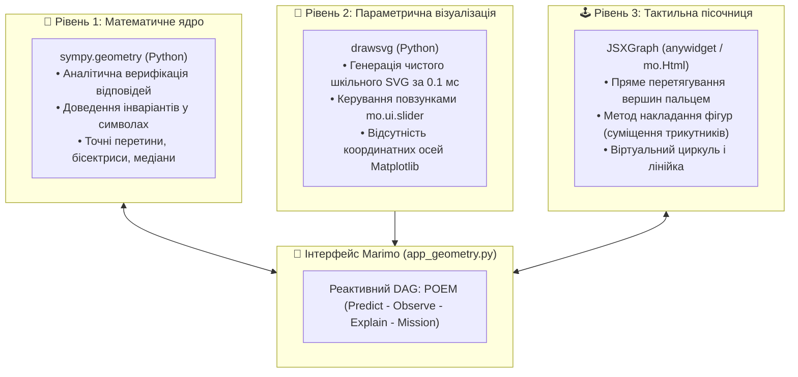
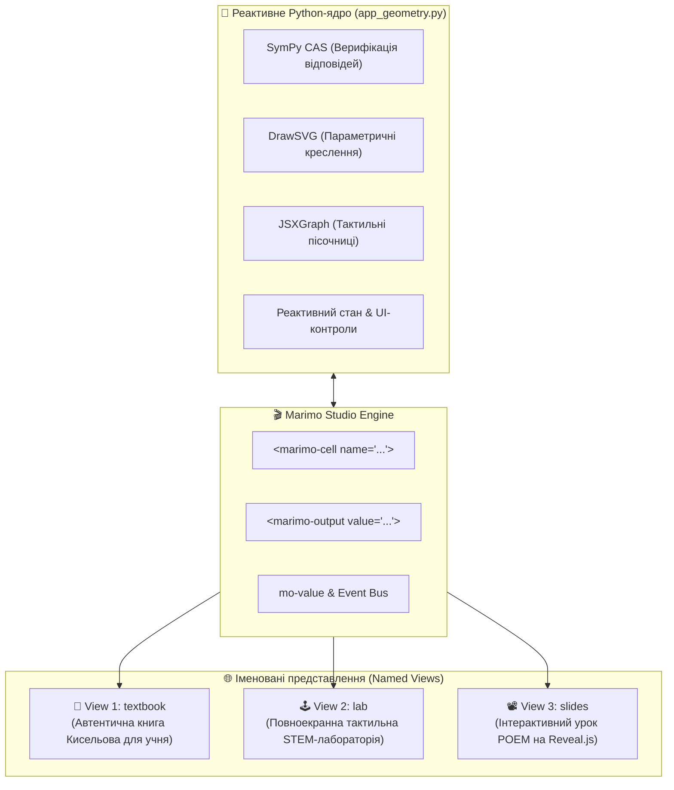
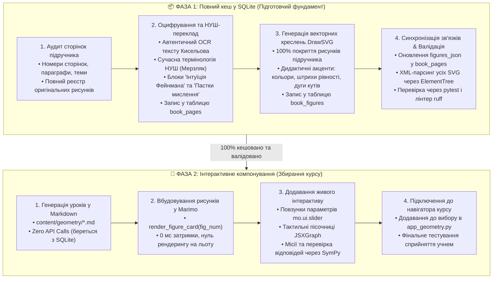

# 📐 Архітектура цифрового курсу «Інтерактивна геометрія Кисельова»
## Трирівнева інтерактивна система: SymPy + DrawSVG + JSXGraph у Marimo

---

## 1. Концепція та філософія (Digital-First)

Цей документ є **канонічним технічним і методичним стандартом** розробки курсу планіметрії 7 класу на базі підручника А. П. Кисельова («Элементарная геометрия», 1931 р.), синхронізованого зі стандартом НУШ (підручник А. Г. Мерзляка, 2024 р.).

### 1.1. Відмова від паперового баласту (Zero PDF Overhead)
* Основний продукт — **живий інтерактивний цифровий підручник-лабораторія**, що працює в середовищі **Marimo** (`marimo run` локально та `marimo export html-wasm` автономно на GitHub Pages).
* Поліграфічна підготовка, двопрохідна компіляція XeLaTeX, боротьба з розривами сторінок A4 та паперові QR-коди **повністю виключені** з конвеєра.
* Інтерактивні моделі, повзунки та маніпулятиви знаходяться **безпосередньо в тексті перед очима дитини**.

---

## 2. Трирівнева технологічна архітектура

Вся геометрична взаємодія розділена на три чіткі, взаємодоповнюючі рівні:



### 2.1. Рівень 1: `sympy.geometry` (Математичний мозок)
* **Призначення:** Верифікація відповідей учня, символьні розрахунки, перевірка еквівалентності розв'язків без помилок округлення.
* **Ключові сутності:** `Point2D`, `Line2D`, `Segment2D`, `Ray2D`, `Circle`, `Triangle`.
* **Функціонал:**
  * Перевірка колінеарності точок: `Point.is_collinear(A, B, C)`.
  * Перевірка паралельності та перпендикулярності: `l1.is_parallel(l2)`, `l1.is_perpendicular(l2)`.
  * Пошук елементів трикутника: `t.medians`, `t.altitudes`, `t.bisectors`, `t.incenter`, `t.circumcircle`.
  * Перевірка рівності/подібності: `t1.is_similar(t2)`, `t.is_isosceles()`, `t.is_right()`.

### 2.2. Рівень 2: `drawsvg` (Векторні шкільні креслення)
* **Призначення:** Швидка генерація чистих, красивих векторних рисунків до кожного параграфа та теореми.
* **Чому не Matplotlib:** Matplotlib призначений для графіків функцій із сітками та осями. `drawsvg` створює автентичні геометричні креслення з підписами точок $A, B, C$, кольоровими відрізками та дугами кутів без візуального шуму.
* **Швидкість:** Генерується у чистому Python за $< 0.5$ мс і миттєво вставляється в Marimo через `mo.Html(d.as_svg())`.
* **Реактивність:** Зміна значень у повзунках Marimo (`mo.ui.slider`, `mo.ui.radio`) миттєво перемальовує SVG без ривків.

### 2.3. Рівень 3: `JSXGraph` (Тактильний інтерактив)
* **Призначення:** Застосовується **точково** лише там, де дитині критично необхідно взаємодіяти з фігурою пальцем або мишкою:
  1. *Модель ножиць* (перехрещені прямі для вертикальних кутів).
  2. *Накладання трикутників* (обертання і перетягування копії трикутника до повного суміщення для ознак С-К-С, К-С-К).
  3. *Жорсткість трикутника* (тягни за вершини трикутника — форма фіксована; тягни за чотирикутник — він деформується).
  4. *Побудови циркулем і лінійкою* (проведення кіл, пошук перетинів засічок).
* **Інтеграція:** Через вбудований HTML/JS (`mo.Html`) або компактний `anywidget`, що надсилає координати точок назад у Python для перевірки через SymPy.

---

## 3. Стандарти UI/UX типографіки: Інтерактивна книга (Interactive Book)

Застосунок розробляється не як адміністративний дашборд чи панель керування, а як **жива інтерактивна шкільна книга**:

### 3.1. Принцип повноти тексту без скорочень
* У кожному розділі міститься **повний, нестислий адаптований текст Кисельова** за сучасною термінологією НУШ (параграф за параграфом).
* Текст не обрізається, не згортається у прев'ю-блоки та не ховається у скролбари.

### 3.2. Ритм сприйняття та чергування матеріалу
Текст параграфів органічно переривається дидактичними вставками в наступному порядку:
1. **Теоретичне означення / властивість** (повний текст параграфа Кисельова).
2. **Інтерактивне креслення (DrawSVG)** або **тактильний маніпулятив (JSXGraph)** безпосередньо під відповідним твердженням.
3. **Блок «🧠 Інтуїція Фейнмана»** (фізична або побутова модель: повертання променя, шарнір ножиць, жорсткість трикутної ферми).
4. **Блок «⚠️ Пастка мислення»** (попередження типової помилки учня: чому $180^\circ \neq$ суміжні, чому кут має бути строго між сторонами).
5. **🎯 Практична місія** (автентична задача Кисельова з полем вводу та миттєвою символьною перевіркою SymPy).

### 3.3. Ергономіка читання для учня 7 класу (UI/UX)
* **Ширина зони читання:** строго обмежена до **`max-width: 760–780px`** по центру екрана. Це відповідає золотому стандарту книжкової верстки (60–75 символів у рядку) та запобігає швидкій втомі очей дитини.
* **Розмір шрифту:** **`19px`** для основного тексту (замість стандартного дрібного 14–16px) з міжрядковим інтервалом **`line-height: 1.75`** для легкого сприйняття тексту з математичними формулами $A_1B_1C_1, \angle \alpha$.
* **Очищення від технічного шуму:** В інтерфейсі суворо заборонено показувати системні терміни: *«SQLite Cache-First»*, *«3-рівнева система»*, *«клітинки DAG»*, системні ID *«angles»*. Усі заголовки, розділи та підписи формулюються виключно літературною українською мовою для учня.

---

## 4. Дидактична структура уроку: Методологія POEM

Кожен урок у курсі проєктується за 4-кроковим когнітивним циклом **POEM** (відповідно до стандартів `stem-didactics` для учнів 7 класу):

```text
[ 1. PREDICT (Прогноз) ]      ---> Зіткнення з інтуїтивним наївним уявленням
         ↓
[ 2. OBSERVE (Дослід) ]       ---> Сфокусована маніпуляція повзунком (drawsvg) або точками (JSXGraph)
         ↓
[ 3. EXPLAIN (Пояснення) ]    ---> Інтуїція Фейнмана + Теорема Кисельова + Пастка мислення
         ↓
[ 4. MISSION (Мікро-виклик) ] ---> Інтерактивна задача з перевіркою через SymPy (3 рівні підказок)
```

### Спеціальні педагогічні блоки:
* **🧠 Інтуїція Фейнмана:** Фізична або життєва аналогія до математичного факту (кут як поворот променя, жорсткість ферм мостів).
* **⚠️ Пастка мислення:** Попередження типової учнівської помилки (наприклад: «два кути з сумою $180^\circ$ не завжди суміжні — потрібна спільна сторона!»).
* **🪜 Сократівські підказки (Scaffolding):**
  * *Рівень 1 (Концептуальний):* натяк на сутність ідеї.
  * *Рівень 2 (Формульний):* ключова геометрична рівність.
  * *Рівень 3 (Повний розбір):* покроковий логічний висновок.

---

## 4. Структура репозиторію

Нова організація каталогів проєкту:

```text
Algebra/
├── content/
│   └── geometry/                      # Канонічні уроки у форматі Markdown (.md)
│       ├── 00_introduction.md         # Вступ: фігури, пряма, відрізок, коло
│       ├── 01_angles.md               # Кути: суміжні та вертикальні
│       ├── 02_triangles_equality.md   # Ознаки рівності трикутників
│       ├── 03_triangle_types.md       # Рівнобедрений трикутник, медіани, висоти
│       └── 04_parallel_lines.md       # Паралельні прямі та січна
├── src/
│   └── geometry_engine/               # Чисті функції (Pure Python) для Marimo
│       ├── __init__.py
│       ├── svg_drawings.py            # Бібліотека генерації креслень на drawsvg
│       ├── sympy_solver.py            # Математичний мозок на sympy.geometry
│       └── jsx_templates.py           # Шаблони інтерактивних віджетів JSXGraph
├── app_geometry.py                    # Головний реактивний веб-підручник Marimo
├── pyproject.toml                     # Залежності: marimo, sympy, drawsvg, pydantic
└── tests/
    └── test_geometry_engine.py        # Тести на SymPy-розв'язувач та SVG-генератор
```

---

## 5. Стандарти реалізації коду

### 5.1. Стандарт генерації креслень (`src/geometry_engine/svg_drawings.py`)
Кожна функція креслення повинна бути чистою (*pure function*), приймати числові параметри та повертати готовий об'єкт `drawsvg.Drawing`:

```python
import drawsvg as draw
import math


def draw_adjacent_angles(alpha_deg: float, width: int = 340, height: int = 180) -> draw.Drawing:
    """Генерує векторне креслення суміжних кутів α та β = 180° - α."""
    d = draw.Drawing(width, height)
    d.append(draw.Rectangle(0, 0, width, height, fill="#f8fafc", rx=8))

    ox, oy = width // 2, height - 30
    ray_len = 110

    # Горизонтальна пряма (доповняльні промені)
    d.append(draw.Line(ox - ray_len, oy, ox + ray_len, oy, stroke="#334155", stroke_width=2.5))

    # Рухомий спільний промінь
    rad = math.radians(alpha_deg)
    rx = ox + ray_len * math.cos(rad)
    ry = oy - ray_len * math.sin(rad)
    d.append(draw.Line(ox, oy, rx, ry, stroke="#2563eb", stroke_width=3))

    # Вершина
    d.append(draw.Circle(ox, oy, 4, fill="#0f172a"))
    d.append(draw.Text("O", 14, ox - 5, oy + 20, fill="#0f172a", font_weight="bold"))

    # Дуги та підписи кутів
    d.append(
        draw.Text(f"α = {alpha_deg:.0f}°", 13, ox + 30, oy - 20, fill="#2563eb", font_weight="bold")
    )
    d.append(
        draw.Text(
            f"β = {180 - alpha_deg:.0f}°", 13, ox - 75, oy - 20, fill="#dc2626", font_weight="bold"
        )
    )

    return d
```

### 5.2. Стандарт математичної перевірки (`src/geometry_engine/sympy_solver.py`)
Кожна перевірка розв'язку учня має виконуватися через строгі геометричні примітиви SymPy:

```python
import sympy as sp
from sympy.geometry import Point, Triangle, Line


def verify_adjacent_angle(given_angle_deg: float, user_answer_str: str) -> dict:
    """Перевіряє правильність обчислення суміжного кута."""
    expected = 180 - given_angle_deg
    try:
        user_val = float(sp.sympify(user_answer_str))
        is_correct = abs(user_val - expected) < 1e-4
        return {
            "correct": is_correct,
            "expected": expected,
            "user_val": user_val,
            "message": "Чудово! Сума завжди 180°."
            if is_correct
            else f"Спробуй ще. Пам'ятай: 180° - {given_angle_deg}°.",
        }
    except Exception:
        return {
            "correct": False,
            "message": "Введи числове значення або вираз (наприклад, 180 - 45).",
        }
```

---

## 6. Промпт-протокол для VLM (Оцифровка сканів у Markdown)

Коли Gemini або інша VLM обробляє скан сторінки Кисельова, вона керується такими суворими правилами:

1. **Термінологія НУШ:** Заборонені русизми (`чертеж` $\to$ `креслення`, `прилежащий` $\to$ `прилеглий`, `признак` $\to$ `ознака`, `равенство` $\to$ `рівність`).
2. **Формули:** Завжди у форматі KaTeX (`$...$` та `$$...$$`).
3. **Блоки:**
   ```markdown
   ::: feynman Назва блоку
   Текст інтуїтивного пояснення...
   :::

   ::: misconception Пастка мислення
   Текст розбору типової помилки...
   :::
   ```
4. **Мітки інтерактиву:** Замість сирого коду вставляється декларативна мітка:
   ```markdown
   [INTERACTIVE: draw_triangle_congruence(criterion="SAS")]
   ```

---

## 7. План впровадження

| Етап | Задача | Результат |
| :---: | :--- | :--- |
| **Етап 1** | Налаштування оточення та інфраструктури | `drawsvg` додано в `pyproject.toml`, створено структуру `content/geometry/` та `src/geometry_engine/`. |
| **Етап 2** | Портування Розділу 1 («Кути») у новий формат | Файл `01_angles.md` + SVG-моделі суміжних, вертикальних кутів та бісектриси на `drawsvg`. |
| **Етап 3** | Розробка Розділу 2 («Трикутники та їх рівність») | Оцифровка §§ 27–45 оригіналу Кисельова: ознаки С-К-С, К-С-К, С-С-С, тактильна модель накладання трикутників. |
| **Етап 4** | Збірка головного Marimo-додатку `app_geometry.py` | Інтерактивний підручник із перемиканням уроків, POEM-моделями та тренажером задач. |
| **Етап 5** | Інтеграція Marimo Studio (Multi-View) | Розділення обчислювального ядра та незалежних веб-представлень: `textbook`, `lab`, `slides`. |

---

## 8. Архітектурна еволюція: Інтеграція Marimo Studio (Multi-View Architecture)

Новітня екосистема **Marimo Studio** (`marimo-studio`, v0.2.3+, спільна розробка Marimo Team, ETH Zurich IVIA Lab та CMU Data Interaction Group) дозволяє вивести цифровий курс на якісно новий рівень чистоти та дидактичної сили завдяки концепції:
> **«Один реактивний блокнот — безліч різних представлень» (One reactive notebook. Many views.)**

### 8.1. Концепція поділу «Ядро обчислень» $\leftrightarrow$ «Іменовані представлення (Named Views)»

Замість змішування всієї верстки сторінки, стилів та математики в одному файлі блокнота, система розділяється на два незалежні шари:
1. **Обчислювальне ядро (`app_geometry.py`):**
   - Зберігає повний стан, математичні розрахунки SymPy, генерацію векторних креслень DrawSVG, шаблони JSXGraph та реактивні контролери `mo.ui.*`.
   - Клітинки мають явні зрозумілі імена функцій (наприклад: `def line_illustrations()`, `def angle_controls()`, `def sympy_task()`).
   - Клітинки не переобтяжуються візуальною версткою великих HTML-карток.
2. **Іменовані веб-представлення (`Named Views` у каталозі `__marimo__/studio/app_geometry/`):**
   - Кожне представлення є незалежним веб-проєктом (HTML/CSS або React/Svelte/Reveal.js), орієнтованим на конкретну задачу та аудиторію.
   - Представлення підключаються до живого ядра Marimo і підтягують потрібні клітинки та значення через декларативні проекційні хости.



---

### 8.2. Специфікація трьох ключових представлень для курсу

#### 1. Представлення `textbook` (Автентичний підручник для читання учнем)
* **Провайдер:** `Vanilla (HTML + CSS + JS)`. Без важких бандлерів, найвища швидкість завантаження.
* **Ціль:** 100% книжкова естетика підручника Кисельова для вдумливого читання дитиною без жодного сліду коду чи технічних панелей.
* **Верстка:**
  - Зона читання фіксована на `max-width: 780px`, шрифт 19px, міжрядковий інтервал 1.75, вирівнювання за шириною.
  - Повний текст Кисельова без скорочень у розмітці статті.
  - Вставки проекцій у точках розділу:
    ```html
    <!-- Вставка живого креслення прямої та відрізка -->
    <marimo-output value="svg_lines"></marimo-output>

    <!-- Вставка інтерактивного повзунка суміжних кутів -->
    <marimo-cell name="adjacent_angles_widget"></marimo-cell>
    ```

#### 2. Представлення `lab` (Тактильна STEM-лабораторія)
* **Провайдер:** `Vanilla HTML/JS` або `Svelte`.
* **Ціль:** Дослідницький ігровий режим. Текст зведено до стислих завдань, акцент — на великі маніпулятиви (ножиці, накладання фігур, креслення циркулем).
* **Верстка:** Двоколонковий або повноекранний макет: ліворуч — список експериментів та місій, праворуч — велика інтерактивна дошка з віджетами.

#### 3. Представлення `slides` (Інтерактивний урок POEM)
* **Провайдер:** `Reveal.js` (через стартер `marimo-studio/react:reveal` або чистий Reveal).
* **Ціль:** Покрокове проходження теми біля інтерактивної дошки або спільно з батьками на планшеті за методологією POEM (Передбач $\to$ Досліди $\to$ Поясни $\to$ Виконай місію).
* **Слайди:**
  - Слайд 1: Концептуальний виклик («Що буде з кутами ножиць?»).
  - Слайд 2: Інтерактивний дослід із рухомою точкою.
  - Слайд 3: Інтуїція Фейнмана та строга теорема.
  - Слайд 4: Мікро-тест із миттєвою символьною перевіркою SymPy.

---

### 8.3. Проекційні механізми (Projection Hosts)

Згідно зі специфікацією Marimo Studio, зв'язок між HTML-сторінкою та Python-клітинами реалізується через 3 форми проекції всередині контейнера `#app-shell`:

1. **Повна клітинка (`<marimo-cell name="cell_function_name"></marimo-cell>`):**
   - Проектує клітинку разом з її елементами керування (`mo.ui.slider`, `mo.ui.dropdown`).
   - Зміна значення користувачем запускає перерахунок залежних клітин у ядрі Python.
2. **Результат клітинки (`<marimo-output value="output_variable_name"></marimo-output>`):**
   - Відображає готове зображення (SVG від `drawsvg`, HTML або LaTeX формулу).
   - Підтримує вкладений доступ до полів словників і об'єктів: `value="mission_result['message']"`.
3. **Пряме значення у браузер (`<span mo-value="variable_name"></span>`):**
   - Передає чисте значення змінної Python у DOM через властивість `host.marimoValue`.
   - Генерує подію `marimo-value-updated`, дозволяючи писати кастомні клієнтські скрипти та анімації.

---

### 8.4. Покроковий план впровадження (Верифіковано з Context7)

План базується на перевірених офіційних інтерфейсах `marimo` (Context7 docs `/websites/marimo_io` та `/marimo-team/marimo`) та CLI `marimo-studio`:

#### 🔹 Фаза 1: Рефакторинг ядра `app_geometry.py` для чистої проекції
1. **Явне іменування функцій клітинок:**
   - Перетворити анонімні клітинки `@app.cell def __():` на семантичні іменовані функції:
     - `def header_and_navigation(mo): ...`
     - `def intro_illustrations(mo, draw_line_segment_ray, ...): ...`
     - `def angles_interactive(angle_slider, draw_angle, ...): ...`
     - `def sympy_verifier(task_input, verify_adjacent_angle, ...): ...`
   - Це забезпечить пряму адресність клітинок для тегів `<marimo-cell name="...">`.
2. **Винесення глобальних стилів підручника:**
   - Зафіксовано в Context7: використання `app = marimo.App(css_file="content/geometry/book.css")` замість ін'єкцій стилів у тіло кожної клітинки через `mo.Html`.

#### 🔹 Фаза 2: Підключення `marimo-studio` до проєкту
1. Додати пакет до `pyproject.toml` через `uv`:
   ```powershell
   uv add marimo-studio
   ```
2. Зафіксувати версію в `pyproject.toml` (з урахуванням рекомендації виробника щодо експериментального статусу).

#### 🔹 Фаза 3: Генерація та налаштування представлення `textbook`
1. Створити перше представлення через CLI:
   ```powershell
   uv run marimo-studio view create textbook --target app_geometry.py
   ```
2. Налаштувати структуру проєкту представлення:
   ```text
   __marimo__/studio/app_geometry/
   └── textbook/
       ├── view.toml      # Конфігурація провайдера (Vanilla)
       ├── index.html     # Чистий семантичний HTML5-шаблон книги
       ├── AGENTS.md      # Правила для ШІ-агента при роботі з цим представленням
       └── DESIGN.md      # Керівництво стилю: шрифти 19px, золоті пропорції полів, пастельні акценти
   ```
3. Розмістити у `index.html` адаптований текст Кисельова із вбудованими тегами `<marimo-cell>` та `<marimo-output>`.

#### 🔹 Фаза 4: Верифікація, тестування та доставка
1. **Локальний запуск у режимі живої взаємодії:**
   ```powershell
   uv run --with marimo-studio marimo run app_geometry.py --no-sandbox
   ```
2. **Автоматизована перевірка готовності (E2E):**
   - Перевірка наявності атрибута `html[data-marimo-studio-state="ready"]`.
   - Тестування реактивності: зміна повзунка кута $\alpha$ оновлює відповідне SVG-креслення без помилок у консолі.
3. **Офлайн-експорт у WebAssembly (WASM):**
   - Експорт готового курсу для роботи без встановленого Python на планшеті учня:
     ```powershell
     uv run marimo-studio export wasm app_geometry.py --view textbook -o dist/textbook/
     ```

---

## 9. Виробничий стандарт розробки наступних розділів: Cache-First Two-Stage Pipeline
### Парадигма: «Спочатку повний кеш — потім компонування»

Для масштабування курсу на наступні розділи геометрії 7, 8 та 9 класів встановлено непорушний **двоетапний виробничий конвеєр**. 
**Суворе правило:** Жоден рядок коду Marimo та жоден файл уроку Markdown не створюються, доки Фаза 1 не виконана на 100%.



### 9.1. Фаза 1: Повний кеш у SQLite (Full Pre-Cached Ingestion)
1. **Інвентаризація першоджерела:**
   - Визначити точний діапазон друкованих сторінок (наприклад, стор. 51–90) та відповідні PDF-сторінки (`pdf_page = printed_page + 1`).
   - Скласти повний список параграфів (§§) та рисунків (наприклад, Рис. 90 – Рис. 140).
2. **Пакетне оцифрування тексту в `book_pages`:**
   - Зберегти повний нестислий текст оригіналу в `ocr_ru`.
   - Зберегти якісний, педагогічно вивірений український переклад у `translation_uk` без радянських кальок.
   - Додати до кожної сторінки поля `feynman_notes` (побутові/фізичні аналогії) та `misconceptions` (попередження помилок).
   - Встановити статус `status = 'verified'`.
3. **Векторне відтворення рисунків у `book_figures`:**
   - Написати функції для генерації кожного рисунка у DrawSVG.
   - Дотримуватися палітри дизайн-системи: синій `#2563eb` для основних фігур, червоний `#dc2626` для січних і бісектрис, зелений `#16a34a` для рівних елементів і прямих кутів, сланцевий `#0f172a` для вершин і тексту.
   - Зберегти всі рисунки в `book_figures` із полями `fig_id`, `fig_num`, `title`, `page_num`, `svg_content`, `caption_original`, `didactic_notes`.
4. **Синхронізація зв'язків:**
   - Оновити поле `figures_json` у `book_pages` для кожної сторінки: список `["fig_090", "fig_091", ...]`.
5. **Автоматична валідація кешу:**
   - Перевірити всі SVG-рядки через `xml.etree.ElementTree.fromstring` на валідність XML.
   - Перевірити послідовність номерів рисунків без пропусків.
   - Запустити тести: `uv run pytest tests/test_geometry_engine.py`.

### 9.2. Фаза 2: Інтерактивне компонування (Interactive Assembly)
1. **Чисті файли Markdown (`content/geometry/*.md`):**
   - Генерувати текст уроків безпосередньо з SQLite.
   - Жодних запитів до Gemini чи зовнішніх API під час верстки — швидкість складання миттєва.
2. **Інтеграція в Marimo (`app_geometry.py`):**
   - Вставка рисунків через кешований хелпер: `render_figure_card(fig_num)` повертає готову HTML-картку із заголовком, чистим інлайн-SVG та дидактичним підписом.
   - Затримка рендерингу — 0 мс (Zero Recomputation).
3. **Додавання практичних місій та динаміки:**
   - Підбір задач до теми з перевіркою відповідей через `sympy_solver.py`.
   - Точкове додавання віджетів JSXGraph або повзунків `mo.ui.slider` там, де потрібен тактильний рух.
4. **Контроль якості:**
   - `uv run ruff check . --fix` та `uv run ruff format .`.
   - Запуск Marimo для візуальної перевірки: `uv run marimo edit app_geometry.py`.

