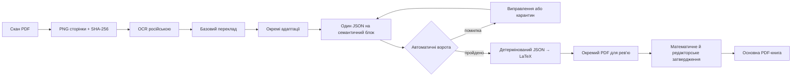

# Архітектура конвеєра адаптації геометрії

_Рішення для поетапного перекладу книги Кисельова без переповнення контексту агента._

---

## 📋 Розуміння завдання

- Основним продуктом є PDF-книга в `book_geometry/`.
- LLM працює з одним семантичним блоком, а не з цілим розділом.
- Оригінал, OCR, переклад та редакторські вставки мають окреме походження.
- LaTeX є згенерованим представленням структурованого змісту.
- Математичні твердження проходять детерміновані перевірки та людську рецензію.
- Інтерактивні матеріали залишаються необов'язковим доповненням.

## 🎯 Припущення

- Перший етап охоплює планіметрію для 7 класу.
- Вихідні скани є суспільним надбанням і можуть оброблятися локально або через OCR API.
- `sympy.geometry` достатньо для точних базових відношень, але не замінює формального доведення.
- `hypothesis` використовується для пошуку контрприкладів і граничних числових випадків.
- Людина затверджує остаточний переклад і кожне геометричне доведення.

## 📚 Рішення

1. Канонічний зміст зберігається як дрібні JSON-блоки з Pydantic-схемою.
2. Кожен блок містить посилання на PDF-сторінку, друковану сторінку, скан і його SHA-256.
3. Модель, промпт, глосарій та статус рецензування версіонуються.
4. Авторські доповнення не змішуються з перекладом першоджерела.
5. Декларативні математичні перевірки виконуються через SymPy.
6. Маніфест дає агенту змогу відновити роботу без історії попереднього чату.

## Поточний конвеєр



Важлива межа: OCR, переклад і адаптація — різні поля. Редакторська вставка не може
мовчки потрапити до перекладу. Історична вставка без джерела переходить до карантину,
а не до книги.

## Контекстний протокол агента

Одна робоча одиниця — один семантичний блок (параграф, теорема, вправа або розв’язання).
Для чергового виклику LLM завантажуються лише:

1. один або кілька потрібних кропів джерела;
2. OCR цього блока;
3. релевантні записи глосарія;
4. короткі резюме попереднього й наступного блоків;
5. декларативні математичні перевірки та попередній QA-звіт.

Повний Markdown розділу, усі попередні діалоги й уся книга не передаються. Стан роботи
відновлюється з JSON-блока та `data/geometry/source_manifest.jsonl`. Це робить процес
повторюваним і не прив’язує якість до розміру контекстного вікна.

## Ворота якості

| Ворота | Автоматична перевірка | Коли потрібна людина |
|---|---|---|
| Походження | файл скану існує, SHA-256 збігається | межі блока або кропа неоднозначні |
| Схема | Pydantic забороняє невідомі поля | змінюється редакційна модель |
| Термінологія | заборонені кальки, допустимі словоформи | контекстно залежний термін |
| Рисунки | кожне `рис. N` має декларацію | векторна реконструкція й alt-текст |
| Математика | SymPy та точні градуси/хвилини/секунди | доведення й відповідність програмі |
| Адаптації | тип, заголовок, статус, цитати | педагогічна доречність і тон |
| PDF | XeLaTeX без помилок і layout warnings | візуальний перегляд усіх сторінок |

LLM не є валідатором власного результату. Вона пропонує OCR, переклад або пояснення;
детерміновані перевірки відсіюють формальні помилки, а редактор затверджує зміст.

## Команди відтворення пілота

```powershell
uv run python -m geometry_pipeline.migrate_pilot
uv run geometry-pipeline validate-content
uv run geometry-pipeline build-manifest
uv run geometry-pipeline render-latex
uv run pytest -q
```

Рендерер створює:

- `book_geometry/generated/sections/00_introduction.tex` — вступні §§ 1–12;
- `book_geometry/generated/sections/section_01_angles_content.tex` — фрагмент для книги;
- `book_geometry/review_generated.tex` — автономний документ для рев’ю;
- `book_geometry/build/generated_review/review_generated.pdf` — зібраний PDF.

Основний `book_geometry/main.tex` уже використовує згенерований вступ, але розділ «Кути»
поки бере з ручної еталонної версії. Повністю перемикати розділ на генерацію слід після
людського звірення перекладу та всіх доведень.

## Стан пілота «Кути»

- мігровано вступні §§ 1–12, 14 параграфів (§§ 13–26) і 7 вправ;
- усі 33 блоки мають прив’язку до фізичної та друкованої сторінки;
- одна непідтверджена історична вставка ізольована в карантині;
- автоматична валідація: 0 помилок, 0 попереджень;
- 27 джерельних рисунків мають окремі TikZ-файли та українські описи;
- структуроване рев’ю: 15 сторінок без layout warnings;
- основна книга: 19 сторінок без layout warnings.

## 🔍 Розглянуті альтернативи

| Варіант | Рішення |
|---|---|
| Один Markdown на розділ | Відхилено через великі контексти та слабке походження фрагментів |
| Ручний LaTeX як джерело правди | Відхилено через дублювання перекладу й верстки |
| Z3 як основне ядро | Відкладено до появи тверджень, які не покриває SymPy |
| Shapely | Не використовується для доведень; бібліотека орієнтована на обчислювальну геометрію |
| SymPy + Hypothesis | Обрано для точних обчислень і пошуку контрприкладів |

## ✍️ Журнал рішень

| Рішення | Причина |
|---|---|
| JSON замість YAML | Не потребує додаткової залежності та має строгий парсер |
| Один файл на семантичний блок | Мінімальний контекст і прості git-дифи |
| Детерміновані перевірки до LLM-рецензії | Дешеві помилки відсіюються без витрат токенів |
| Людський фінальний контроль | Поточні бібліотеки не є повними довідниками евклідової геометрії |

## 🔗 Джерела

SymPy надає точні двовимірні геометричні сутності та перевірки відношень[^1]. Hypothesis генерує тестові приклади й мінімізує знайдені контрприклади[^2].

[^1]: SymPy. “Geometry module.” https://docs.sympy.org/latest/modules/geometry/index.html

[^2]: Hypothesis. “Hypothesis documentation.” https://hypothesis.readthedocs.io/en/latest/
